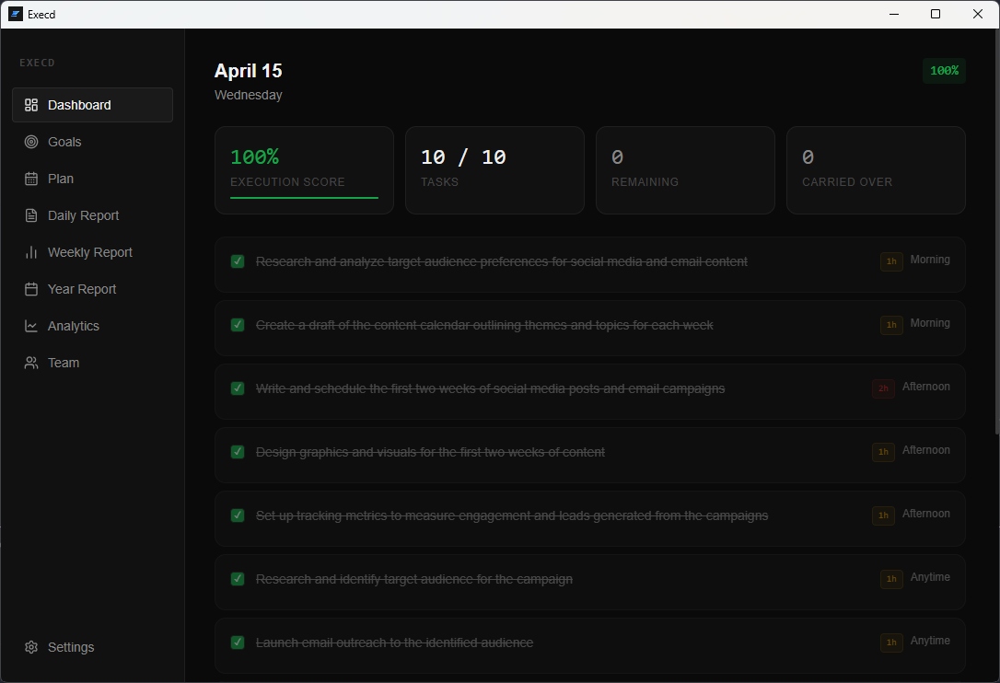
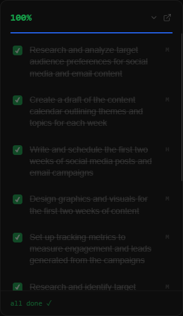
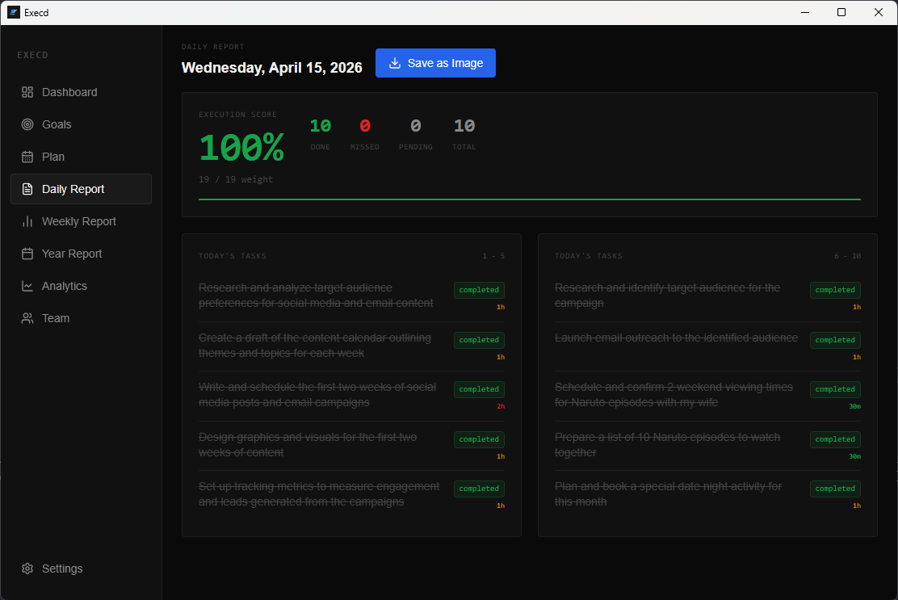
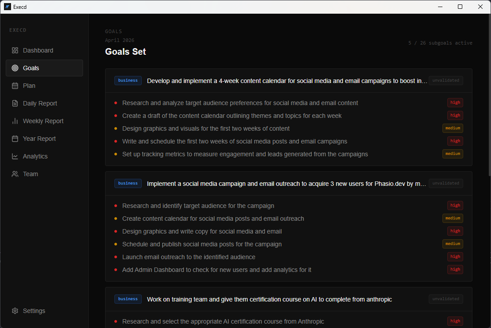

# Execd

Execution enforcement for founders. Not a task manager.

[](https://github.com/YagneshKhamar/execd/actions/workflows/build.yml)

`Platform: Windows · macOS · Linux`  
`Stack: Electron · React · TypeScript · SQLite`  
`Status: v1.1.0`

## What This Is

Execd is a local-first desktop app that turns monthly goals into daily execution. It converts goals into AI-generated subgoals, then into scoped daily tasks based on your real working hours. It enforces execution with an always-on overlay, proof-required task completion, and strict end-of-day scoring. This is not a habit tracker or a to-do app. It is an enforcement system.

## How It Works

Monthly Goals -> AI Subgoals -> Daily Tasks -> Lock Plan -> Execute with Proof -> End Day Score -> AI Feedback -> Repeat

## Features

- 5 monthly goals (3 business, 1 personal, 1 family) — fixed structure for focused execution.
- AI validation and subgoal expansion — goals are checked and broken into concrete deliverables.
- Daily task generation scoped to working hours — plans fit your available time.
- Plan lock — tasks freeze, execution begins — no mid-day reshuffling.
- Proof of completion required (comment or link) — completion claims need evidence.
- Always-on-top overlay with live task status — execution state stays visible while you work.
- Hourly system notifications — periodic prompts to check progress.
- Carry-over system (max 2 tasks) — forces prioritization and limits spillover.
- Execution score (weighted by effort) — performance reflects task difficulty.
- Brutal AI end-of-day feedback — direct analysis of misses and patterns.
- Daily report with image export — capture and share day summary.
- Weekly, monthly, and yearly reports — multi-level performance visibility.
- Analytics with AI pattern diagnosis — charted trends plus AI interpretation.
- Works with OpenAI, Anthropic, Ollama (local, free), OpenRouter — choose cloud or local models.
- Team task management — assign tasks to up to 10 team members, track weekly progress, schedule follow-ups.
- Follow-up notifications — hourly reminders for pending team follow-ups scheduled for today.
- Manual task adding — add tasks manually for today or tomorrow directly from the dashboard.
- Configurable daily task limit — set between 5 and 15 tasks per day in settings.
- Replan once per day — regenerate tasks once if the plan needs adjustment, carry-overs preserved.
- Dev/prod database separation — development and production use separate SQLite databases automatically.

## Screenshots

### Dashboard



### Overlay



### Daily Report



### Goals



## Download

Pre-built installers are available on the [Releases page](../../releases).

| Platform | File                                              |
| -------- | ------------------------------------------------- |
| Windows  | `Execd-Setup-1.1.0.exe`                           |
| macOS    | `Execd-1.1.0.dmg`                                 |
| Linux    | `Execd-1.1.0.AppImage` or `execd_1.1.0_amd64.deb` |

Download the file for your platform, run the installer, and launch Execd.
No Node.js or technical setup required.

## Run From Source

### Prerequisites

- Node.js 22 or higher
- npm

### Start in Development

```bash
git clone https://github.com/YagneshKhamar/execd.git
cd execd
npm install
npm run dev
```

### Build for Distribution

```bash
npm run build        # current platform
npm run build:win    # Windows installer
npm run build:mac    # macOS DMG
npm run build:linux  # Linux AppImage + deb
```

Output goes to the `dist/` folder.

## First Run

1. Setup screen — enter AI provider and API key (or configure Ollama for free local AI).
2. Goals screen — define 5 monthly goals, AI validates and expands each into subgoals.
3. Today screen — generate daily tasks, lock your plan.
4. Execute tasks with proof, end the day, get feedback.
5. Overlay stays on screen while you work.

## AI Provider Options

| Provider                 | Cost                                                                                              | Setup                                   |
| ------------------------ | ------------------------------------------------------------------------------------------------- | --------------------------------------- |
| OpenAI (gpt-4o-mini)     | Pay per use (~$0.01/day typical)                                                                  | API key from platform.openai.com        |
| Anthropic (claude-haiku) | Pay per use (~$0.01/day typical)                                                                  | API key from console.anthropic.com      |
| Ollama                   | Free, runs locally                                                                                | Install from ollama.com, pull any model |
| OpenRouter               | Free tier available — use non-reasoning models to avoid JSON parse issues (see AI Provider Notes) | API key from openrouter.ai              |

Recommended for most users: Ollama (free, private, no API key).  
Recommended if you want best AI quality: OpenAI gpt-4o-mini or Anthropic claude-haiku.

## Project Structure

```text
src/
├── main/          — Electron main process, IPC handlers, SQLite
├── preload/       — Secure bridge between main and renderer
├── renderer/      — React UI (pages, components, assets)
└── shared/        — Types and constants shared across processes
```

## Tech Stack

| Layer         | Technology                |
| ------------- | ------------------------- |
| Desktop shell | Electron v39              |
| UI            | React + TypeScript        |
| Styling       | Tailwind CSS v4           |
| Database      | SQLite via better-sqlite3 |
| Build         | electron-vite             |
| Icons         | lucide-react              |
| Charts        | recharts                  |

## AI Provider Notes

**OpenRouter reasoning models** (DeepSeek R1, Nemotron 3 Super, Qwen3 thinking
variants) return internal reasoning wrapped in `<think>` tags before the JSON
response. This can cause JSON parse errors in the app.

If you hit this issue, either:

- Switch to a non-reasoning model (Llama 3.3 70B, Mistral Small, DeepSeek V3)
- Or add this line to `callAI()` in `src/main/ipc/ai.ipc.ts`:
  `raw = raw.replace(/<think>[\s\S]*?<\/think>/g, '').trim()`

## Team Feature

The Team page lets you track task assignments across up to 10 team
members without requiring separate logins. Everything is tracked
locally on your machine.

- Add members with name, role, and email
- Assign tasks with effort level and due date per week
- Track task status (pending / completed / blocked)
- Add notes to tasks for context
- Schedule follow-ups with a date and note
- Today's follow-ups appear as a reminder banner on the Dashboard
- Overdue tasks surface automatically in the weekly view
- Hourly notifications fire when follow-ups are pending for today

This feature is designed for founders managing a small team who need
a lightweight way to delegate and follow up without switching tools.

## Known Limitations

- API key stored as plaintext — encryption planned for a future release
- Goals cannot be edited once set for the month
- Monthly plan page is read-only
- No data export or backup yet
- Auto-update not configured
- OpenRouter reasoning models may cause JSON parse errors — see AI Provider Notes

## Roadmap

### v1.2.0
- [ ] API key encryption via Electron safeStorage
- [ ] Auto-update UI — check for new releases from inside the app
- [ ] Analytics empty state handling for new users
- [ ] Data export to CSV

### v1.3.0
- [ ] Hosted AI option — no API key needed
- [ ] Monthly goal editing with confirmation flow
- [ ] Goal carry-over between months

### Help Wanted
Good first issues for contributors:
- Add keyboard shortcuts for common actions (lock plan, complete task)
- Improve error messages across all pages
- Add more chart types to Analytics page
- Write unit tests for IPC handlers

## Philosophy

Most founders do not fail because they cannot plan. They fail because nothing enforces execution once the plan exists. Execd is built to close that gap between planning and doing, day after day. No motivational language, no streak systems for vanity, no gamification loop. Proof or it did not happen.

## License

MIT
